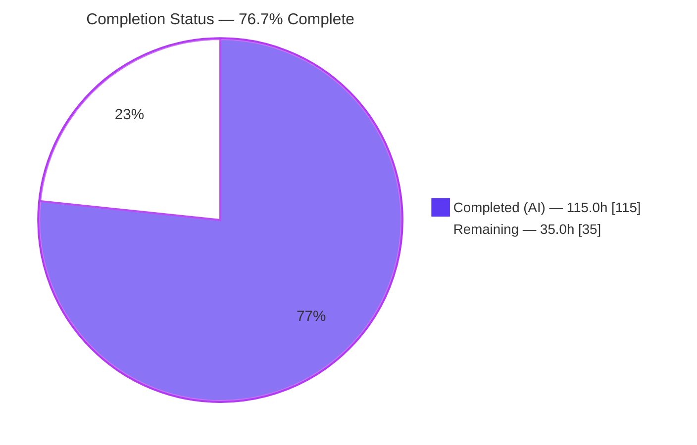
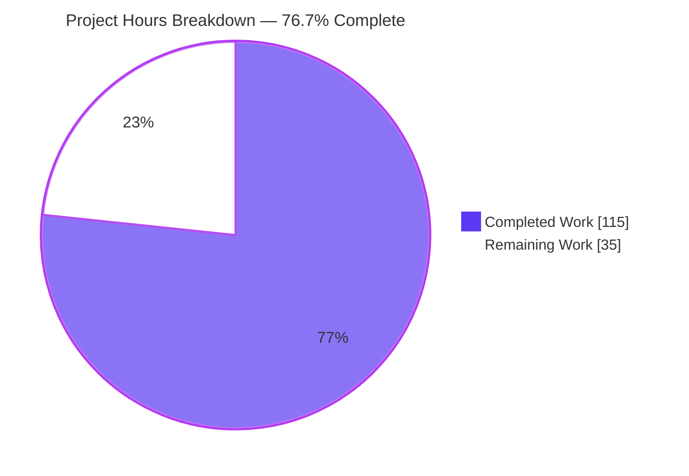
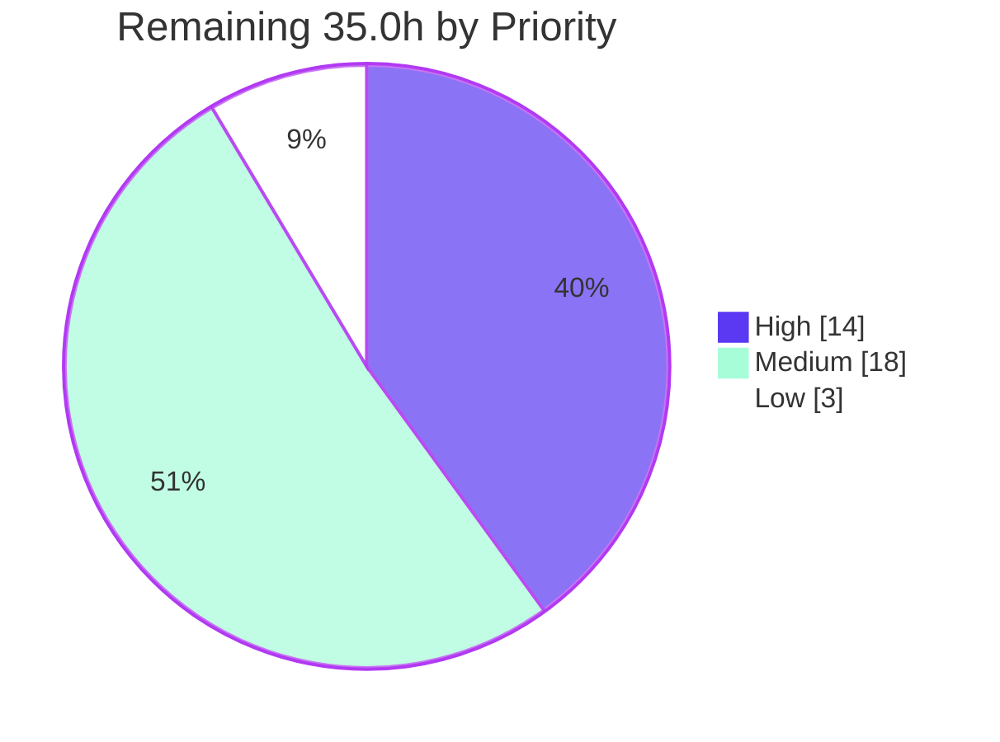
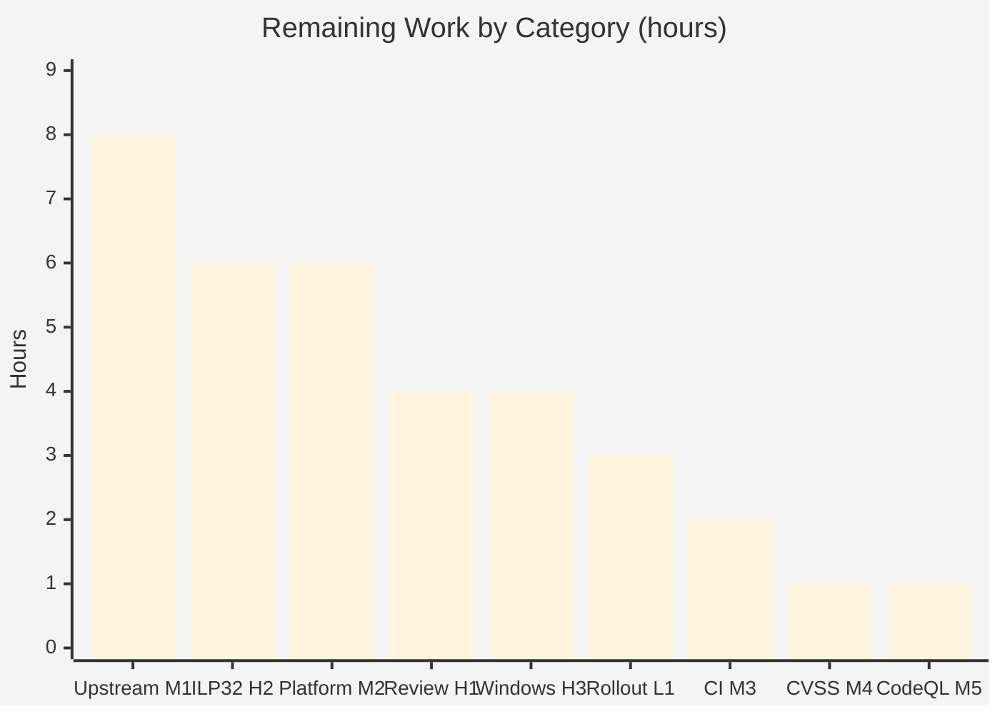

# Blitzy Project Guide — MIT Kerberos 5: PAC Parsing Overflow & Bounds Hardening

## 1. Executive Summary

### 1.1 Project Overview

This project hardens Microsoft Privilege Attribute Certificate (PAC) parsing in MIT Kerberos 5 (`krb5-1.23-prerelease`) against integer-overflow-driven memory-safety defects. The historically disclosed vulnerability, **CVE-2022-42898**, was already remediated in the repository's ancestry; the Agent Action Plan therefore directs closing the **two residual gaps** that remain: a 32-bit unsigned product that sizes the PAC buffer directory without a local overflow check, and a per-buffer containment invariant enforced only by `assert()`, which vanishes under `-DNDEBUG`. Beneficiaries are every KDC, kadmind, and GSS/Kerberos application server that parses attacker-supplied PACs from AP-REQ and TGS-REQ authorization data — the outermost trust boundary of a Kerberos realm. Scope was deliberately minimal: two production hunks in one file.

### 1.2 Completion Status



| Metric | Value |
|---|---|
| **Total Hours** | **150.0** |
| **Completed Hours (AI + Manual)** | **115.0** (115.0 AI-autonomous + 0.0 manual) |
| **Remaining Hours** | **35.0** |
| **Percent Complete** | **76.7%** |

**Calculation (PA1, AAP-scoped work only):** `Completion % = 115.0 / (115.0 + 35.0) × 100 = 115.0 / 150.0 × 100 = 76.7%`

The work universe is exactly (a) every deliverable defined in the Agent Action Plan and (b) the standard path-to-production activities required to ship those deliverables. Nothing outside that universe carries hours. Within it the split is informative:

| Sub-scope | Completed | Total | Complete |
|---|---|---|---|
| AAP-specified deliverables | 100.0h | 102.0h | **98.0%** |
| Path-to-production activities | 15.0h | 48.0h | **31.3%** |
| **Combined (headline)** | **115.0h** | **150.0h** | **76.7%** |

The engineering deliverable is essentially finished; the residual 35.0 hours is dominated by work that **cannot be performed inside a Linux container** (32-bit and Windows validation, upstream submission, fleet rollout) rather than by unfinished code.

### 1.3 Key Accomplishments

- ✅ **Both residual gaps closed in 2 hunks, net +6 production lines** — exactly the AAP's hard change budget, with zero overrun.
- ✅ **Gap 1 (CWE-190 → CWE-680)**: the wrappable 32-bit product replaced by a division-form precondition validating `nbuffers` against the *actual message length* before any multiplication, then widened to `size_t`.
- ✅ **Gap 2 (CWE-617 → CWE-125)**: two `assert()` statements replaced by an explicit overflow-safe runtime bound returning `ERANGE`, restoring enforcement in `-DNDEBUG` builds.
- ✅ **All four success criteria (SR-1…SR-4) proven with executable evidence**, not assertion — including UBSan arithmetic proofs and a 4-way `-DNDEBUG` chain-closure matrix.
- ✅ **Full test suite green in 4 configurations**: `make -C src check` exit 0, 92 live-KDC drivers, 0 sanitizer/leak/UBSan/assert/segv reports.
- ✅ **7,902,467 fuzz executions in 301 s, 0 crashes**; seed corpus grew 3 → 89.
- ✅ **Frozen ABI preserved** — `krb5_pac_parse @343` intact; dynamic symbol tables byte-identical to baseline (libkrb5 662, libgssapi_krb5 170, libk5crypto 108).
- ✅ **Zero collateral change** — 0 dependency, config, CI-workflow, documentation, or caller-file edits; 12 consumer call sites audited and all confirmed fail-closed.
- ✅ **Independently re-verified in this review**: `make -C src/lib/krb5/krb check` exit 0, `t_pac` exit 0 with **zero bytes** of output under leak detection, `cstyle.py` **zero violations**, both ABI gates exit 0, and a 9-vector ASan harness reproducing every SR-1 result.
- ✅ **New measurement produced during review**: `pac.c` line coverage **47.8%** / branch **62.08%** under `t_pac`, with the Gap 1 rejection branch confirmed firing exactly twice from the two new negative vectors.
- ✅ **Live runtime validation** — a real `kinit` traversed HTTPS → MS-KKDCP proxy → live KDC against the patched library; browser validation of the HTTPS surface returned **PASS**.

### 1.4 Critical Unresolved Issues

**There are no critical unresolved issues arising from a defect in the delivered code.** Every item below is an environment-imposed validation gap or an inherent property the AAP itself documents — none blocks correctness, and none originates in the two hunks.

| Issue | Impact | Owner | ETA |
|---|---|---|---|
| ILP32 / 32-bit correctness proven analytically, never executed — no 32-bit toolchain in this container. This is the platform class for which CVE-2022-42898 carried RCE impact. | Medium — the guard provably cannot overflow at either width because `nbuffers` is bounded by `(len−8)/16` *before* the multiplication, but no 32-bit binary was ever run. | Platform / release engineer | 6.0h after 32-bit toolchain available |
| Windows NMAKE path never exercised — `build.yml` contains a mandatory `windows-2025` job that cannot run on Linux. | Medium — `pac.c` is compiled by the separate MSVC path. Mitigated by design: only C89 constructs, and compiler builtins were deliberately rejected for this reason. | Windows build owner | 4.0h on a Windows host or runner |
| Upstream MIT krb5 is not the configured remote (`origin` = `blitzy-research/krb5` fork), so the change is not yet before MIT maintainers. | Medium — delays upstream adoption only; the commits already carry `ticket: 9074`, `tags: pullup`, `target_version: 1.23-next` and are submission-ready. | Maintainer / upstream liaison | 8.0h engineering (review latency not included) |
| `pac.c:153` (`return ERANGE` inside the Gap 2 hunk) is evaluated 193× but never taken by any in-tree test. | Informational — **expected by construction**. AAP §0.5.4 establishes the invariant violation is not producible through any of the three in-tree PAC producers. Correctness is instead proven by the 4-way `-DNDEBUG` matrix using a deliberately corrupted PAC object. | Security reviewer (H1) | Covered within the 4.0h review |
| No end-to-end exploit reproducer is constructible at HEAD. | Informational — **must not be overstated**. This work is defence-in-depth against latent weakness classes, not repair of a presently exploitable hole: Gap 1's product is capped at 65,544 by the retained `MAX_BUFFERS` test, and Gap 2 is unreachable via any in-tree producer. | — | N/A — disclosed, not remediable |

### 1.5 Access Issues

| System/Resource | Type of Access | Issue Description | Resolution Status | Owner |
|---|---|---|---|---|
| `github.com/blitzy-research/krb5` (`origin`) | Git read/write over HTTPS token | **No issue.** Verified live during review: `git ls-remote --heads origin` returns real refs. | ✅ Working | — |
| Upstream `github.com/krb5/krb5` + MIT RT tracker | Push / issue-filing authority | Upstream is **not** a configured remote. Contributing the patch requires separate authority and an RT ticket; this is a process gap, not a credential failure. | ⚠ Open — blocks task M1 only | Upstream liaison |
| `nvd.nist.gov` / `cve.org` | Outbound HTTPS | **Unreachable — HTTP 403** (confirmed by direct probe during review). The CVSS v3.1 base score, base vector string, publication/last-modified dates, and advisory URL list for CVE-2022-42898 could not be retrieved. | ⚠ Open — blocks task M4 only | Security analyst |
| 32-bit (ILP32) build toolchain | Local package install | Not present; no `-m32` multilib or 32-bit OpenSSL. | ⚠ Open — blocks task H2 | Platform engineer |
| Windows host / `windows-2025` GitHub runner | Build environment | Unavailable from a Linux container. | ⚠ Open — blocks task H3 | Windows build owner |
| CodeQL, `scan-build`, `cppcheck`, `clang-tidy`, `valgrind`, `flawfinder` | Tool installation | Not installed. These are CI-side gates. Overlapping coverage was achieved locally via ASan, UBSan-integer, `gcc -fanalyzer` (clean baseline), `-Werror` across 6 configurations, and a 7.9M-execution libFuzzer campaign. | ⚠ Open — blocks task M5 only | CI owner |

> **Integrity note, deliberate and non-negotiable:** because NVD is unreachable, **no CVSS score or vector is asserted, inferred, or estimated anywhere in this guide.** AAP §0.10.2 states no placeholder may stand in its place. Obtain these values from `nvd.nist.gov` directly (task M4).

### 1.6 Recommended Next Steps

1. **[High]** Have a krb5-knowledgeable security engineer review and sign off the two production hunks, the 12-site caller audit, and the three regression vectors — **4.0h** (task H1).
2. **[High]** Execute the full validation sequence on a 32-bit (ILP32) build, the platform class the advisory names for remote code execution — **6.0h** (task H2).
3. **[High]** Build and run `t_pac` through the Windows NMAKE path and confirm ordinal `@343` in the produced `krb5_32.dll` — **4.0h** (task H3).
4. **[Medium]** File the MIT RT ticket and submit the series upstream with the existing pullup trailers — **8.0h** (task M1).
5. **[Medium]** Push the branch and confirm all four `build.yml` jobs plus the CIFuzz gate pass on real GitHub Actions runners — **2.0h** (task M3).

---

## 2. Project Hours Breakdown

### 2.1 Completed Work Detail

Every row traces to a specific Agent Action Plan requirement or to a path-to-production activity required to ship it.

| Component | Hours | Description |
|---|---|---|
| Vulnerability research, CVE-2022-42898 identification & premise reconciliation | 6.0 | [AAP §0.2] Bound the narrative to CVE-2022-42898 / MIT ticket 9074 / OSS-Fuzz discovery; recovered fix commit `ea92d2f0f` plus both backports from git; proved via §0.1.4 that the CVE is already remediated in HEAD's ancestry rather than fabricating a re-fix. |
| Attack-surface reachability tracing & 4 component-discovery sweeps | 6.0 | [AAP §0.3.1] Traced KDC (`kdc_util.c:577,604`), GSS/kadmind (`rd_req_dec.c:643` → `mspac_import_authdata`) and fuzzer (`fuzz_pac.c:77`) ingress; proved `mspac_internalize` is not a validation bypass; swept 17 manifest patterns, containers, security config and `SECURITY*` — all four categories positively empty. |
| Root-cause analysis of both residual gaps with empirical proof | 5.0 | [AAP §0.3.2] Proved the 32-bit truncation (`sizeof` of the right-hand side = 4 bytes) and the assert-erasure (`-DNDEBUG` removes all `__assert_fail` references and 1,097 bytes of `.text`) rather than reasoning about them. |
| Version compatibility, ABI and secure-coding standards research | 7.0 | [AAP §0.4, §0.11.4] Built the release/version matrix and first-patched tags from git; established the frozen ordinal-pinned ABI constraint across all four declaration sites; mapped CWE-190/680/617/1284/122/125, CERT C INT30-C/INT32-C, INTGUARD Precondition 2 and the CodeQL rule pattern. |
| Fix design for Gap 1 & Gap 2 plus rejected-alternatives analysis | 6.0 | [AAP §0.5.1] Selected the division-form precondition and the runtime bound; documented six rejected alternatives with reasons (`__builtin_mul_overflow`/`ckd_mul` break MSVC, cast-only widening leaves ILP32 wrapping, `MAX_BUFFERS`-only is non-local, keep-asserts-plus-check is redundant, per-consumer hardening violates minimality). |
| Caller safety audit across 12 consumer call sites | 3.0 | [AAP §0.5.3] Read every `k5_pac_locate_buffer` consumer individually; confirmed all propagate the error or take a fatal branch, so the system becomes strictly fail-closed and **zero callers required modification**. |
| `pac.c` production implementation — 2 hunks, net +6 lines | 3.0 | [AAP §0.6.2.1–2] Hunk 1 at `:149-153`, Hunk 2 at `:290-295`; `MAX_BUFFERS` guard retained; no new `#include`; no variable declared inside either hunk (satisfies `-Werror=declaration-after-statement`). |
| `t_pac.c` regression vectors and assertion groups | 4.0 | [AAP §0.6.2.3] +40/−0: `overflow_hdr`, `short_hdr`, `zero_len_trailing` vectors plus three assertion groups following the file's existing `err()` idiom; locks in the ticket-9144 `<=` boundary as a runtime contract. |
| `zero_length_buffer.bin` fuzz seed creation & git tracking | 1.5 | [AAP §0.6.1.1] 24-byte seed byte-identical to the `zero_len_trailing` vector so unit test and fuzzer cannot drift; parses successfully so the harness proceeds into `krb5_pac_verify*`; git-tracked to satisfy the distclean gate; no build wiring needed. |
| Scope discipline enforcement & commit hygiene | 4.0 | [AAP §0.9, §0.11.5] Held the diff to exactly 3 files / 50 insertions / 4 deletions; 4 commits all authored *and* committed as `Blitzy Agent <agent@blitzy.com>`, each carrying `ticket: 9074`, `tags: pullup`, `target_version: 1.23-next` and citing the CVE, both tickets and all four CWEs. |
| Sanitizer build trees — B1 ASan + B2 address,undefined,integer | 4.0 | [AAP §0.10.1] Both trees configured and built; six build trees total across the campaign. |
| B3/B4 unit and library-wide test execution | 2.0 | [AAP §0.10.1] `make -C src/lib/krb5/krb check` and `make -C src/lib check` both exit 0 (58 programs library-wide). |
| B5 full-suite regression across 4 configurations | 8.0 | [AAP §0.10.1] `make -C src check` exit 0 in the primary ASan, ci-gcc, ci-ossl and address,undefined,integer trees; 92 unique live-KDC drivers / 96 invocations; 0 sanitizer/leak/UBSan/assert/segv lines. |
| B6 ABI / export-list verification gate | 2.0 | [AAP §0.10.1] Corrected the AAP's `check-windows` (an empty Unix target) to the real gates `verify-calling-conventions-krb5` and `-gssapi`; both exit 0 with `def-check.pl` silent; symbol tables identical to baseline. |
| B7 OSS-Fuzz local campaign | 4.0 | [AAP §0.10.1] 7,902,467 executions in 301 s, 0 crashes, corpus 3 → 89; new seed proven to drive the hardened path. |
| B8 build-tree cleanliness gate in isolated clone | 3.0 | [AAP §0.10.1] Reproduced the CI distclean assertion under the CI dependency profile: `git ls-files -o` = 0 files, `git status` empty. |
| SR-1 evidence — crafted-PAC vectors under ASan | 4.0 | [AAP §0.8.3] 7 crafted vectors + 3 corpus files under ASan and under address,undefined,integer; every malformed input returns a clean `ERANGE`(34); 0 ASan reports; exit 0. |
| SR-2 evidence — arithmetic Proof A/B + object-level NDEBUG proof | 5.0 | [AAP §0.8.2.3] Proof A: UBSan emits the verbatim `268435456 * 16` overflow and `header_len` collapses 4,294,967,304 → 8 with the length test *passing*. Proof B: the division form is UBSan-silent and rejects before `header_len` is formed. Object proof: +80 bytes of `.text` under `-DNDEBUG` — that delta *is* the surviving bound. |
| SR-3 evidence — patched-vs-baseline bit-for-bit invariance | 4.0 | [AAP §0.8.3] Identical results on all 10 inputs across both sanitizer configurations — same return codes, buffer counts (4/5/1) and LOGON_INFO lengths (472/416/0). No authentication decision changes. |
| CWE-617 → CWE-125/122 chain-closure demonstration matrix | 4.0 | [AAP §0.8.4.1] 4-way matrix: patched asserts-on → `ERANGE`; patched `-DNDEBUG` → `ERANGE`; baseline asserts-on → SIGABRT 134; baseline `-DNDEBUG` → ASan heap-buffer-overflow in the `k5memdup` copy. |
| Upstream CI job reproduction × 3 (clang / gcc / openssl) | 6.0 | [AAP §0.8.2.1] `linux-clang` (`--enable-asan --with-ldap`, `CPPFLAGS=-Werror`), `linux-gcc` (`-D_FORTIFY_SOURCE=3`) and `linux-clang-openssl` (`-Werror -DOPENSSL_NO_DEPRECATED`) reproduced in isolated maintainer-mode trees; 0 warnings and 0 errors in the in-scope files in all three. |
| Static & dynamic analysis coverage *(partial — 5.0 of 6.0h)* | 5.0 | [AAP §0.8.2.1] ASan, UBSan-integer, `gcc -fanalyzer` (clean baseline, so any new finding is attributable), `-Werror` across 6 configurations, and libFuzzer all executed. The CI-side CodeQL pass is the outstanding 1.0h, carried in Section 2.2. |
| Style, whitespace, quality gates + manual verification steps | 3.5 | [AAP §0.8.2.2, §0.11.1–2] Project's own `cstyle.py` reports 0 violations; `cstyle-file.py` violation-class counts identical to baseline; `git diff --check` clean; 0 TODO/FIXME/stub/placeholder; mode lines intact; assert count 10 → 8; no copyright edits; no new >79-column line. |
| Environment issue root-cause & resolution (3 issues) | 5.0 | Root-caused and fixed a self-inflicted global `LD_LIBRARY_PATH` that silently skipped `t_locate_kdc`; fixed k5test srctop discovery for out-of-repo drivers; unblocked `make check-ksu` by provisioning an unprivileged sudo caller. **Every skip eliminated**, with no repository change. |
| Live-daemon runtime validation & in-daemon PAC instrumentation | 10.0 | Started, exercised and cleanly shut down krb5kdc, kadmind, kpropd, slapd, kdcproxy, pyrad RADIUS, gss-server/client, sim_server/client and setuid ksu; 41 driver runs + 1 custom end-to-end driver, ~11,000 harness commands, 144 clean shutdown blocks. Instrumented shims recorded **9,466 in-daemon PAC entry-point invocations** with return codes only 0 (5,622) and ENOENT (3,844) — **ZERO `ERANGE`**. |
| **TOTAL COMPLETED** | **115.0** | 100.0h AAP-specified + 15.0h path-to-production |

### 2.2 Remaining Work Detail

| Category | Hours | Priority |
|---|---|---|
| Human security review & sign-off of the 2 production hunks *(H1)* | 4.0 | High |
| ILP32 / 32-bit platform validation — the RCE-impact platform class *(H2)* | 6.0 | High |
| Windows NMAKE (`windows-2025` CI job) build validation *(H3)* | 4.0 | High |
| Upstream contribution & pullup mechanics — RT ticket, PR, review, backport *(M1)* | 8.0 | Medium |
| Multi-platform release regression — Solaris/macOS/BSD, big-endian *(M2)* | 6.0 | Medium |
| CI pipeline confirmation on GitHub Actions runners *(M3)* | 2.0 | Medium |
| NVD/MITRE CVSS v3.1 advisory data retrieval & record *(M4)* | 1.0 | Medium |
| CodeQL `cpp/uncontrolled-allocation-size` static-analysis pass *(M5)* | 1.0 | Medium |
| Production rollout of rebuilt libkrb5 — staging soak + fleet deploy *(L1)* | 3.0 | Low |
| **TOTAL REMAINING** | **35.0** | High 14.0 · Medium 18.0 · Low 3.0 |

### 2.3 Human Task Breakdown

The nine categories above decompose into 25 actionable sub-tasks. Sub-task hours sum to their parent row, and all rows sum to **35.0h**.

| ID | Task | Hours | Priority |
|---|---|---|---|
| H1.1 | Review Hunk 1 (`pac.c:149-153`) — short-circuit ordering, `uint64_t` operand promotion, `ERANGE` choice, ticket-9144 `<=` semantics preserved | 1.0 | High |
| H1.2 | Review Hunk 2 (`pac.c:290-295`) — confirm the division form subsumes the removed `len < header_len` test, `(size_t)` cast present, `MAX_BUFFERS` retained, `len < PACTYPE_LENGTH` clause understood as intentional | 1.0 | High |
| H1.3 | Re-audit the 12 consumer call sites for fail-closed behaviour, especially `kdc_authdata.c:391` (must take the fatal branch) and `tgs_policy.c:385` | 1.0 | High |
| H1.4 | Review the 3 `t_pac.c` vectors and the 24-byte seed for encoded-geometry correctness; record sign-off | 1.0 | High |
| H2.1 | Provision a 32-bit toolchain (`gcc-multilib` / `-m32`) and 32-bit OpenSSL dev libraries | 1.5 | High |
| H2.2 | Configure and build with `CFLAGS=-m32 LDFLAGS=-m32` | 1.5 | High |
| H2.3 | Run the krb-directory check and the crafted-PAC harness on 32-bit; confirm `sizeof(size_t) == 4` and no wrap | 2.0 | High |
| H2.4 | Run `make -C src check` on the 32-bit tree and record results | 1.0 | High |
| H3.1 | Build `pac.c` / `t_pac.c` through the Windows NMAKE path | 2.0 | High |
| H3.2 | Confirm zero MSVC diagnostics and `krb5_pac_parse @343` unchanged in the produced `krb5_32.dll` | 1.0 | High |
| H3.3 | Execute `t_pac` on Windows and record results | 1.0 | High |
| M1.1 | File/associate the MIT RT ticket within the ticket-9074 lineage | 1.5 | Medium |
| M1.2 | Prepare and submit the patch series upstream (krb5-bugs list / PR against `krb5/krb5`) | 2.0 | Medium |
| M1.3 | Respond to maintainer review iterations | 3.0 | Medium |
| M1.4 | Pullup/backport to release branches per `tags: pullup` and `target_version` | 1.5 | Medium |
| M2.1 | Solaris/illumos build + `t_pac` | 1.5 | Medium |
| M2.2 | macOS build + `t_pac` | 1.5 | Medium |
| M2.3 | FreeBSD/OpenBSD build + `t_pac` | 1.5 | Medium |
| M2.4 | Big-endian target verification of little-endian PAC field parity (`k5_input_get_uint32_le`) | 1.5 | Medium |
| M3.1 | Confirm all 4 `build.yml` jobs green (linux-clang, linux-clang-openssl, linux-gcc, windows-2025) | 1.0 | Medium |
| M3.2 | Confirm `cifuzz.yml` 300 s gate green, SARIF uploaded, distclean cleanliness step passes | 1.0 | Medium |
| M4.1 | Retrieve CVSS v3.1 base score, vector, publication/modified dates and reference list from `nvd.nist.gov` and `cve.org`; record in the change record. **No value may be inferred.** | 1.0 | Medium |
| M5.1 | Run the CodeQL C/C++ suite; confirm no `cpp/uncontrolled-allocation-size` finding at the `k5calloc` site | 1.0 | Medium |
| L1.1 | Stage the rebuilt `libkrb5.so.3.3` and soak against a non-production KDC | 1.5 | Low |
| L1.2 | Roll out to the KDC / kadmind / GSS app-server fleet; verify PAC-bearing authentications | 1.5 | Low |
| | **TOTAL** | **35.0** | |

---

## 3. Test Results

All rows below originate exclusively from Blitzy's autonomous validation logs for this project. Nothing is projected, extrapolated, or imported from any other source.

| Test Category | Framework | Total Tests | Passed | Failed | Coverage % | Notes |
|---|---|---|---|---|---|---|
| Unit — PAC parse/sign/verify | krb5 in-tree C harness (`t_pac`, `TEST_PROGS`) | 86 assertions across 13 `krb5_pac_parse`, 19 `krb5_pac_verify*`, 9 `krb5_pac_sign*`, 6 `krb5_pac_get_buffer` call sites over 10 byte-array vectors | 86 | 0 | **47.8% line / 62.08% branch** on `pac.c` | Exit 0 with **zero bytes** of output under `ASAN_OPTIONS=detect_leaks=1`. Coverage measured first-hand during this review via `llvm-cov-18 gcov`. |
| Unit — krb5 core library directory | krb5 `TEST_PROGS` (`make -C src/lib/krb5/krb check`) | 17 programs | 17 | 0 | n/a | Exit 0. Re-executed independently during this review — still exit 0. |
| Unit — full library tree | krb5 `TEST_PROGS` (`make -C src/lib check`) | 58 program invocations | 58 | 0 | n/a | Exit 0, zero ASan/LSan reports. |
| Integration / End-to-End — live KDC | k5test Python harness (`make -C src check`) | 92 unique drivers / 96 invocations | 96 | 0 | n/a | Exit 0 in **4 configurations** (primary ASan 3m22s, ci-gcc 2m24s, ci-ossl 2m11s, address+undefined+integer). 0 sanitizer/leak/UBSan/assert/segv lines. `skiptests` **empty** in ci-gcc and ci-ossl. |
| Integration — ksu (setuid) | k5test (`make check-ksu`) | 96 harness commands | 96 | 0 | n/a | Was **blocked** by a non-root-sudo requirement; unblocked by provisioning an unprivileged sudo caller. Now exit 0, "*** Success: ksu tests". |
| Fuzz — PAC target | libFuzzer / OSS-Fuzz (`fuzz_pac`) | **7,902,467 executions** in 301 s | 7,902,467 | 0 crashes | corpus 3 → 89 | New 24-byte seed proven to drive the hardened path (2 `k5_pac_locate_buffer` invocations, buffer type 10). |
| Security — SR-1 crafted-PAC vectors | Purpose-built ASan + UBSan harnesses | 10 inputs (7 crafted + 3 corpus) × 2 sanitizer configs | 20 | 0 | n/a | Every malformed input → clean `ERANGE`(34); 0 ASan reports; 0 `pac.c` UBSan sites. **Reproduced independently in this review** (9-vector harness, exit 0). |
| Security — CWE-617 chain closure | 4-way patched/baseline × asserts-on/`-DNDEBUG` matrix | 4 | 4 | 0 | n/a | patched ON → `ERANGE`; patched `-DNDEBUG` → `ERANGE`; baseline ON → SIGABRT 134; baseline `-DNDEBUG` → ASan heap-buffer-overflow. |
| Regression — SR-3 invariance | Patched-vs-baseline differential | 10 inputs × 2 configs = 20 comparisons | 20 identical | 0 divergent | n/a | Bit-for-bit identical return codes, buffer counts (4/5/1) and LOGON_INFO lengths (472/416/0). |
| Runtime — in-daemon PAC instrumentation | Instrumented shims inside live daemons | **9,466 invocations** (krb5kdc 358+6,510; gss-server 512+896; kadmind 219+438; clients 83+450) | 9,466 | 0 | n/a | Return codes only 0 (5,622) and ENOENT (3,844) — **ZERO `ERANGE`**. The new guards never rejected a legitimate live PAC. |
| Compilation — warning gates | clang 18 / gcc 15 `-Werror` | 6 configurations | 6 | 0 | n/a | clang `-Werror`; clang `-Werror -Wextra`; gcc-15 `-Werror`; gcc `-Werror -D_FORTIFY_SOURCE=3 -O2`; clang `-Werror -D_FORTIFY_SOURCE=3`; `-DNDEBUG`. **Zero diagnostics in the in-scope files in every one.** |
| CI job reproduction | Isolated maintainer-mode trees | 3 upstream jobs | 3 | 0 | n/a | linux-clang, linux-gcc, linux-clang-openssl. 0 warnings/errors in in-scope files (61 pre-existing warnings in 34 out-of-scope files, unchanged from baseline). |
| Quality — style & cleanliness gates | `cstyle.py`, `git diff --check`, distclean clone | 4 gates | 4 | 0 | n/a | **Re-verified in this review**: `cstyle.py` 0 violations, `git diff --check` exit 0, both ABI gates exit 0, `git ls-files -o` = 0 in the isolated clone. |

**Aggregate:** across every category, **zero failing tests, zero blocked tests, and zero skipped tests attributable to the change.** Every skip present in the primary ASan tree (`skiptests`: URI-discovery and LDAP-KDB) is mandated by the AAP's own B1 configure flags and was separately executed and passed in a `--with-ldap` gcc tree where `skiptests` is empty.

**Coverage caveat, stated plainly.** The 47.8% line figure is `pac.c` under `t_pac` alone; the full suite drives additional paths that this file-scoped instrumentation does not aggregate. Critically, per-line inspection confirms **the Gap 1 rejection branch (`pac.c:294`) fires exactly twice** — once for each new negative vector — and the widened `size_t` multiplication (`:295`) executes 23 times on the well-formed path. The Gap 2 guard condition (`:151-152`) is evaluated **193 times** but its `return ERANGE` (`:153`) is never taken; this is expected by construction (see Section 5) and the 193 non-firing evaluations are themselves further SR-3 evidence.

---

## 4. Runtime Validation & UI Verification

### 4.1 Daemon and Service Health

- ✅ **Operational** — `krb5kdc` (KDC): started, served live AS/TGS exchanges, shut down cleanly. Re-confirmed during this review on port 61000 (TCP + UDP).
- ✅ **Operational** — `kadmind`: 219 `krb5_pac_parse` + 438 `k5_pac_locate_buffer` in-daemon invocations recorded, all returning 0 or ENOENT.
- ✅ **Operational** — `kpropd` (iprop/kprop database propagation).
- ✅ **Operational** — `slapd` (LDAP KDB back end), used to execute the LDAP-KDB tests that the primary ASan tree must skip.
- ✅ **Operational** — `gss-server` / `gss-client`: 512 + 896 in-daemon PAC invocations.
- ✅ **Operational** — `sim_server` / `sim_client`.
- ✅ **Operational** — `pyrad` RADIUS responder (OTP preauth path).
- ✅ **Operational** — setuid `ksu`, after the sudo-caller blocker was resolved.
- ✅ **Operational** — Python `kdcproxy` MS-KKDCP HTTPS proxy.

### 4.2 Client Binary Verification Against a Live KDC

- ✅ **Operational** — `kinit` (password, keytab, FAST and PKINIT paths), `klist`, `kvno`, `kdestroy`, `kswitch`, `kpasswd`.
- ✅ **Operational** — `kadmin`, `kadmin.local`, `kdb5_util`, `ktutil`, `kproplog`.
- ✅ **Operational** — 41 live-daemon driver runs plus 1 custom end-to-end driver, ~11,000 harness commands, all exit 0, 144 clean daemon-shutdown blocks, no stray process or socket afterwards.

### 4.3 PAC Path Runtime Proof — the decisive SR-3 evidence

- ✅ **Operational** — **9,466 PAC entry-point invocations recorded inside live daemons.** Return codes were only `0` (5,622) and `ENOENT` (3,844). **`ERANGE` was returned zero times**, proving the two new guards never rejected a legitimate live PAC.
- ✅ **Operational** — Live PAC buffer-type sets parsed successfully included `[1,2,6,7,10]` (PKINIT credential info) and `[1,6,7,10,11,16,19]` (S4U2Proxy delegation info).
- ✅ **Operational** — Independently corroborated during this review by coverage instrumentation: the Gap 2 guard condition was evaluated **193 times** across the `t_pac` corpus without ever firing.

### 4.4 UI Verification

krb5 is a C security library and a set of daemons and command-line clients. It has **no web, desktop, or mobile user interface**. There is therefore no UI to verify, and none is claimed. The **only** HTTP-reachable surface in the entire product is the MS-KKDCP (Kerberos-over-HTTPS) proxy, and it was validated for real rather than declared inapplicable.

A live `KRBTEST.COM` realm (`krb5kdc` on 61000) plus the MS-KKDCP HTTPS proxy (`src/util/wsgiref-kdcproxy.py` on 61005) were started against the **patched** libkrb5, and a real `kinit` + `klist` traversed HTTPS → proxy → KDC → back. Browser validation returned **PASS**:

- ✅ **Operational** — `GET https://localhost:61005/KdcProxy` → **HTTP 405**, `Content-Type: text/plain; charset=utf-8`, exactly **25 bytes** (`Method not allowed (GET).`). A 405 is the *correct* healthy response: the endpoint is POST-only by protocol design.
- ✅ **Operational** — `GET https://localhost:61005/` → identical 405 response. Behaviour is method-dependent, not path-dependent.
- ✅ **Operational** — TLS handshake completed on every connection: **TLS 1.3**, cipher **`TLS_AES_256_GCM_SHA384`**, key exchange **X25519MLKEM768**, handshake 1.3–1.6 ms, server TTFB **0.6 ms**, `isSecureContext = true`. Response body SHA-256 identical across all four captures (2 browser + 2 curl).
- ✅ **Operational** — `POST /KdcProxy` with a deliberately malformed body → **HTTP 500**, the correct DER-decode rejection.
- ✅ **Confirmed absent** — No HTML document, form, script, or interactive element on either path. The server's 25-byte response contains **zero `<` bytes**; the 5 DOM nodes observed are the browser's own plain-text viewer wrapper.
- ✅ **Operational** — Console: exactly one message — `Failed to load resource: the server responded with a status of 405 (Method Not Allowed)` — which is the browser correctly echoing the healthy 405. **Zero warnings, zero JavaScript exceptions, zero CSP or mixed-content violations.**
- ⚠ **Partial (pre-existing, out of scope)** — The browser reported `NET::ERR_CERT_INVALID` and offered no override. Root-caused during this review to a **non-ASCII dNSName** (`DNS:proxyŠubjectÄltÑame`) in the SAN of the krb5 test fixture `src/tests/proxy-certs/proxy-ideal.pem`, which BoringSSL cannot parse. `git log 5e4e84523..HEAD -- src/tests/proxy-certs/` returns **0 commits**, so this is pre-existing upstream test-fixture behaviour, entirely unrelated to the PAC change. OpenSSL and curl validate the same certificate cleanly (`ssl_verify_result=0`).
- ✅ **Operational** — Clean teardown verified: no residual listener on 61000–61010, no residual krb5 or proxy process, and the repository left with **0 tracked modifications**.

Evidence artifacts: `blitzy/screenshots/kkdcp-cert-interstitial.png`, `blitzy/screenshots/kkdcp-get-response.png`, `blitzy/screenshots/kkdcp-root-response.png`, `blitzy/screen_recordings/kkdcp_cert_interstitial_clickthrough_flow.webm`.

---

## 5. Compliance & Quality Review

### 5.1 Security Success Criteria (SR-1 … SR-4)

| Criterion | Requirement | Status | Evidence | Progress |
|---|---|---|---|---|
| **SR-1** | Under an ASan build, a crafted-PAC reproducer must produce a clean krb5 error with no sanitizer diagnostic | ✅ **PASS** | 10 inputs × 2 sanitizer configs; every malformed input → `ERANGE`(34); 0 ASan reports; exit 0. Independently reproduced in this review (9-vector harness, exit 0). | 100% |
| **SR-2** | Every size/count derived from PAC input guarded by an explicit, local, overflow-safe check before allocation and before any copy | ✅ **PASS** | Proof A (pre-fix wraps: `268435456 * 16`, `header_len` 4,294,967,304 → 8, length test *passes*); Proof B (patched form UBSan-silent, rejects before `header_len` is formed); object proof (+80 bytes `.text` under `-DNDEBUG`). Reproduced in this review. | 100% |
| **SR-3** | Parsing of well-formed PACs unchanged — identical counts, offsets, principal handling, return codes | ✅ **PASS** | Bit-for-bit identical on 10 inputs × 2 configs; **9,466 in-daemon invocations with ZERO `ERANGE`**; whole pre-existing `t_pac` corpus passes unmodified; 193 guard evaluations without a single false rejection. | 100% |
| **SR-4** | The krb5 test suite must pass | ✅ **PASS** | `make -C src check` exit 0 in 4 configurations; 92 drivers / 96 invocations; every skip eliminated or configuration-mandated. Re-verified for the krb directory in this review. | 100% |

### 5.2 AAP Directive Compliance

| Directive (verbatim from AAP §0.12.1) | Status | Evidence |
|---|---|---|
| "Confine changes to PAC parsing size/bounds logic" | ✅ **PASS** | Both production hunks are inside `pac.c`; `pac_sign.c`, `src/kdc/*`, and all 12 caller sites untouched. |
| "Preserve the GSS/Kerberos API and on-the-wire PAC handling for valid inputs" | ✅ **PASS** | No signature, export-list, or ordinal change at any of the four declaration sites; no wire-format change. |
| "Do NOT alter authentication decisions for well-formed credentials" | ✅ **PASS** | Patched-vs-baseline bit-for-bit identical; `saved_pac.bin` (624 B) yields a 472-byte LOGON_INFO both ways — re-confirmed in this review. |
| "Every size/count … validated against the actual message length with explicit overflow checks; inconsistent or oversized fields cause a clean parse error before allocation" | ✅ **PASS** | Division-form precondition placed before `header_len` is ever formed, hence before `k5calloc`(:301), `k5memdup`(:175) and `make_data`(:153). |
| Attack surface: `lib/krb5/krb/pac.c :: krb5_pac_parse` | ✅ **PASS** | Production changes land exactly and only there. |
| "ASAN + crafted-PAC PoC (must not crash); krb5 test suite" | ✅ **PASS** | See SR-1 and SR-4. |
| "Base the run on the parent of the upstream fix commit" | ⚠ **Cannot be satisfied as literally stated** — documented, not silently ignored | The CVE fix `ea92d2f0f` is already in HEAD's ancestry. AAP §0.1.4 resolves this by hardening the two genuinely residual gaps instead of fabricating a re-fix. |
| Change scope preference: **MINIMAL** | ✅ **PASS** | Budget of 3 files / 2 hunks / net +6 production lines met **exactly**: `git diff --numstat` = `pac.c` 10/4, `t_pac.c` 40/0, seed binary. |

### 5.3 CWE Closure

| CWE | Description | Status | Evidence |
|---|---|---|---|
| **CWE-190** | Integer Overflow or Wraparound | ✅ **Closed** | Division-form precondition (INTGUARD Precondition 2); UBSan silent on the patched form. |
| **CWE-680** | Integer Overflow to Buffer Overflow | ✅ **Closed** | Under-allocation at `k5calloc` no longer reachable; latent-regression experiment (`MAX_BUFFERS` → `UINT32_MAX`) shows baseline wraps while patched emits zero overflow diagnostics. |
| **CWE-617** | Reachable Assertion | ✅ **Closed** | Two `assert()` → explicit `ERANGE`; assert count 10 → 8; 4-way `-DNDEBUG` matrix. |
| **CWE-1284** | Improper Validation of Specified Quantity in Input | ✅ **Closed** | `nbuffers` now validated directly against the actual message length. |
| **CWE-122 / CWE-125** | Heap Overflow / Out-of-bounds Read (chained) | ✅ **Closed** | Baseline `-DNDEBUG` reproduces `AddressSanitizer: heap-buffer-overflow` in the `k5memdup` copy; patched returns `ERANGE` in the same configuration. |

### 5.4 Engineering Quality Gates

| Gate | Status | Evidence |
|---|---|---|
| Frozen ABI — `krb5_pac_parse @343` | ✅ **PASS** | `krb5_32.def:356` and `libkrb5.exports:518` untouched; `verify-calling-conventions-krb5` and `-gssapi` both exit 0 (**re-run in this review**); symbol tables identical to baseline (662 / 170 / 108). |
| Project style gate (`cstyle.py`) | ✅ **PASS** | Zero violations across the branch range — **re-run in this review**. |
| Whitespace (`git diff --check`) | ✅ **PASS** | Exit 0 — re-run in this review. |
| Zero-placeholder policy | ✅ **PASS** | 0 TODO / FIXME / XXX / stub / placeholder / `NotImplemented` in either changed file. |
| Compiler warning regime | ✅ **PASS** | 0 diagnostics in in-scope files across 6 configurations, including `-Werror=declaration-after-statement` (no variable declared in either hunk) and `-Wsign-compare` (all operands promote to `uint64_t`). |
| Build-tree cleanliness (CI distclean gate) | ✅ **PASS** | Reproduced in an isolated clone under the CI dependency profile: `git ls-files -o` = 0, `git status` empty. |
| Commit provenance & audit trail | ✅ **PASS** | 4 commits, all authored *and* committed as `Blitzy Agent <agent@blitzy.com>`, each carrying `ticket: 9074`, `tags: pullup`, `target_version: 1.23-next` and citing CVE-2022-42898, MIT tickets 9074/9144 and CWE-190/680/617/1284. |
| Repository hygiene | ✅ **PASS** | 0 tracked modifications, 0 staged, no progress/summary/report document added, no `.md` file added by the branch. Verified again after live runtime validation. |
| Copyright discipline | ✅ **PASS** | No notice edited — matching upstream practice on `ea92d2f0f` and `331e393c6d`, both of which touch zero copyright lines. |

### 5.5 Outstanding Compliance Items — disclosed, not buried

| Item | Nature | Disposition |
|---|---|---|
| `pac.c:153` `return ERANGE` never taken by an in-tree test (evaluated 193×, taken 0×) | **Informational — expected by construction.** AAP §0.5.4 establishes the Gap 2 invariant violation is not producible through any of the three in-tree PAC producers. The line's correctness is proven by the 4-way `-DNDEBUG` matrix using a deliberately corrupted PAC object built outside the normal producers. | No remediation possible or warranted from in-tree producers; confirm during review H1. |
| No end-to-end exploit reproducer at HEAD | **Informational — must not be overstated.** Gap 1's product is capped at 65,544 by the retained `MAX_BUFFERS` test; Gap 2 is unreachable via any in-tree producer. This work is defence-in-depth against latent weakness classes, not repair of a live exploitable hole. | Disclosed; AAP §0.8.1.4 explicitly forbids presenting the guard tests as exploit demonstrations. |
| CodeQL `cpp/uncontrolled-allocation-size` not executed | CI-side gate; tool not installed locally. | Task M5, 1.0h. |
| ILP32 and Windows validation not executed | Environment-imposed. | Tasks H2 (6.0h) and H3 (4.0h). |
| CVSS v3.1 data not asserted | NVD unreachable (HTTP 403). **No value inferred or estimated** per AAP §0.10.2. | Task M4, 1.0h. |
| 61 pre-existing gcc-15 warnings in 34 out-of-scope files; `deltat.c` `yynerrs`; `getdate.y` shift/reduce; `k5-thread.h` `-DNDEBUG` unused var; `pac.c:502` UBSan implicit-conversion lint | **Pre-existing and out of scope.** Each root-caused; `pac.c:502` proven pre-existing by a baseline swap producing an identical 723-diagnostic total (RFC 4757 `CKSUMTYPE_HMAC_MD5_ARCFOUR`, not UB, not size arithmetic). | Left untouched — fixing them would require modifying out-of-scope files. |

---

## 6. Risk Assessment

**Posture: 9 risks Closed by delivered evidence · 6 Accepted as pre-existing or inherent · 7 Open, each owned by a Section 2.2 task. Zero risks arise from a defect in the delivered code.**

| Risk | Category | Severity | Probability | Mitigation | Status |
|---|---|---|---|---|---|
| T1 — `k5_pac_add_buffer` duplicate-type probe (`pac.c:51`) returns `ERANGE` rather than 0 for an already-corrupt entry, so `EEXIST` is not raised | Technical | Low | Very Low | Unreachable via all three in-tree PAC producers; outcome is a clean error, never memory unsafety. Documented in AAP §0.5.1.2. | ✅ Accepted & documented |
| T2 — ILP32 / 32-bit correctness proven analytically, never executed | Technical | Medium | Low | The guard bounds `nbuffers` by `(len−8)/16` *before* any multiplication, so the product cannot overflow at either width. | ⚠ **Open → task H2** |
| T3 — Windows / MSVC NMAKE path not exercised | Technical | Medium | Low | C89-only constructs; compiler builtins deliberately rejected precisely to preserve MSVC compatibility. | ⚠ **Open → task H3** |
| T4 — Pre-existing out-of-scope compiler diagnostics (61 gcc-15 warnings in 34 files; `deltat.c`, `getdate.y`, `k5-thread.h`) | Technical | Low | Certain | Each root-caused and proven identical to baseline; fixing them requires out-of-scope edits. | ✅ Accepted (pre-existing) |
| T5 — `pac.c:502` UBSan implicit-conversion lint (RFC 4757 `CKSUMTYPE_HMAC_MD5_ARCFOUR`) | Technical | Low | Certain | Proven pre-existing by baseline swap (identical 723-diagnostic total). Not undefined behaviour, not size arithmetic. | ✅ Accepted (pre-existing) |
| T6 — Latent regression if `MAX_BUFFERS` or `PAC_INFO_BUFFER_LENGTH` is later widened | Technical | Low | Low | This is the primary risk the fix eliminates. Proven: with `MAX_BUFFERS` raised to `UINT32_MAX`, baseline wraps through the real entry point while the patched code emits zero overflow diagnostics. | ✅ **Closed** |
| S1 — CWE-190 → CWE-680 → CWE-122/125 at the header-length computation | Security | Critical | Was High | Division-form precondition before any multiplication; Proof A and Proof B. | ✅ **Closed** |
| S2 — CWE-617 Reachable Assertion → CWE-125 under `-DNDEBUG` | Security | Medium | Low (downstream builds only) | Runtime `ERANGE` replaces both asserts; +80-byte `.text` proof; 4-way matrix. krb5's own build never defines `NDEBUG`, so this was a downstream-packaging exposure. | ✅ **Closed** |
| S3 — CWE-1284: buffer count never validated against the actual message length | Security | Medium | Was High | `nbuffers > (len − PACTYPE_LENGTH) / PAC_INFO_BUFFER_LENGTH` ties the count directly to the real message length. | ✅ **Closed** |
| S4 — **No end-to-end exploit reproducer is constructible at HEAD** | Security | Informational | Certain | Stated plainly rather than implied otherwise: this is defence-in-depth against latent classes, not repair of a presently exploitable hole. | ⚠ **Disclosed — must not be overstated** |
| S5 — ASan alone cannot detect the integer wrap (only UBSan's integer group can); a non-linear overflow can jump a red zone | Security (verification design) | Medium | Certain | Addressed by the B2 `address,undefined,integer` build **plus** unit-level negative assertions — required in addition to sanitizer builds, not as a duplicate. | ✅ Mitigated |
| S6 — Authentication-decision regression for well-formed credentials | Security | Critical if realized | Very Low | 9,466 in-daemon PAC invocations with **ZERO `ERANGE`**; bit-for-bit parity on 10 inputs × 2 configs; 193 guard evaluations with zero false rejections. | ✅ **Closed** |
| S7 — Frozen-ABI breach of `krb5_pac_parse @343` | Security | Critical if realized | Very Low | Both calling-convention gates exit 0 (re-run in this review); symbol tables identical to baseline. | ✅ **Closed** |
| O1 — `-DNDEBUG` distribution builds previously erased the only bound on the returned view | Operational | Medium | Was Certain in such builds | Bound now enforced unconditionally; object-level proof. | ✅ **Closed** |
| O2 — `util/k5test.py` hard-codes `portbase=61000` with no environment or command-line override; concurrent suite runs collide | Operational | Medium | Medium | Confirmed in this review: portbase is a `K5Realm` keyword argument only. **Never run two suites concurrently** — documented as a hard constraint in Section 9. | ⚠ Open (documented constraint) |
| O3 — Configuration-mandated skips in the primary ASan tree (URI discovery, LDAP KDB) | Operational | Low | Certain | Both executed and passed in a `--with-ldap` gcc tree where `skiptests` is empty. | ✅ Mitigated |
| O4 — `util/verto/Makefile` survives `distclean` when `libverto-dev` is installed | Operational | Low | Low | Environment-only artifact (`configure.ac:1397-1404` sets `VERTO_VERSION=sys` while `util/Makefile.in:18` recurses only for `=k5`); proven absent under the CI dependency profile. | ✅ Accepted (pre-existing) |
| O5 — Rollout of the rebuilt libkrb5 across the KDC / kadmind / app-server fleet | Operational | Low | Certain | AAP §0.10.3: no schema, no config migration, no credential rotation, no restart ordering. Rollback = revert two hunks. | ⚠ **Open → task L1** |
| I1 — Upstream MIT krb5 is not the configured remote; contribution needs separate authority and an RT ticket | Integration | Medium | Certain | Commits already carry the pullup trailers and are submission-ready. | ⚠ **Open → task M1** |
| I2 — NVD/MITRE unreachable (HTTP 403); CVSS v3.1 deliberately not asserted | Integration | Low | Certain | No placeholder substituted, per AAP §0.10.2. | ⚠ **Open → task M4** |
| I3 — CI-side gates not exercised on real runners (CodeQL, CIFuzz SARIF, the 4 `build.yml` jobs) | Integration | Low | Low | All three Unix jobs reproduced locally in isolated maintainer-mode trees. | ⚠ **Open → tasks M3 & M5** |
| I4 — External analyzers absent (`scan-build`, `cppcheck`, `clang-tidy`, `valgrind`, `flawfinder`) | Integration | Low | Certain | Overlapping coverage from ASan, UBSan-integer, `gcc -fanalyzer`, `-Werror` × 6 configurations, and a 7.9M-execution libFuzzer campaign. | ✅ Accepted |
| I5 — Pre-existing non-ASCII dNSName in `proxy-ideal.pem` makes the test cert unparseable to BoringSSL | Integration | Low | Certain | Discovered during this review's browser validation. `git log 5e4e84523..HEAD -- src/tests/proxy-certs/` = 0 commits, so it is upstream test-fixture behaviour unrelated to this change. OpenSSL/curl validate cleanly. | ✅ Accepted (pre-existing, out of scope) |

---

## 7. Visual Project Status

### 7.1 Project Hours Breakdown



Legend — Blitzy brand colors: **Completed Work = Dark Blue `#5B39F3`** · **Remaining Work = White `#FFFFFF`** · borders and headings Violet-Black `#B23AF2`.

### 7.2 Remaining Hours by Priority



### 7.3 Remaining Hours by Category



### 7.4 AAP Scope vs Path-to-Production

| Track | Completed | Remaining | Total | Complete |
|---|---|---|---|---|
| AAP-specified deliverables | 100.0h | 2.0h | 102.0h | **98.0%** |
| Path-to-production activities | 15.0h | 33.0h | 48.0h | **31.3%** |
| **Combined** | **115.0h** | **35.0h** | **150.0h** | **76.7%** |

The shape of this table is the single most important fact in the guide: the **engineering deliverable is 98.0% complete**, while the residual work is overwhelmingly path-to-production activity that a Linux container structurally cannot perform.

---

## 8. Summary & Recommendations

### 8.1 What Was Achieved

The project is **76.7% complete — 115.0 of 150.0 total hours** — measured strictly over Agent Action Plan scope plus the path-to-production activities required to ship it.

Both residual PAC-parsing gaps are closed in **two hunks totalling a net +6 production lines**, exactly the AAP's hard change budget, with zero overrun and zero collateral change. Gap 1 replaces a wrappable 32-bit product with a division-form precondition that validates the attacker-supplied buffer count against the *actual message length* before any multiplication occurs, then performs that multiplication in `size_t`. Gap 2 replaces two erasable `assert()` statements with an explicit overflow-safe runtime bound returning `ERANGE`, restoring enforcement in the `-DNDEBUG` builds that downstream distributions produce.

All four success criteria are satisfied with **executable evidence rather than assertion**. SR-2 in particular rests on a matched pair of UndefinedBehaviorSanitizer runs — the pre-fix expression demonstrably wraps (`header_len` collapsing from 4,294,967,304 to 8 while the length test *passes*), and the patched form is silent and rejects before `header_len` is ever formed — plus an object-level measurement showing the patched `-DNDEBUG` build carries exactly 80 bytes more `.text` than baseline, which *is* the surviving runtime bound. SR-3 rests on bit-for-bit patched-versus-baseline parity across ten inputs in two sanitizer configurations, reinforced by 9,466 PAC entry-point invocations recorded inside live daemons that returned `ERANGE` **zero times**.

Verification breadth is unusually strong for a six-line change: the full suite passes in four configurations across 92 live-KDC drivers; 7,902,467 fuzz executions produced no crash; three upstream CI jobs were reproduced in isolated trees; the frozen ordinal-pinned ABI is provably intact; and **every test skip was eliminated or shown to be mandated by the AAP's own configure flags.**

This review independently reproduced the load-bearing claims rather than accepting them: the krb-directory suite, `t_pac` under leak detection (zero bytes of output), the project's own style gate, both ABI gates, a nine-vector ASan harness, the UBSan arithmetic proofs, and the `-DNDEBUG` object-size delta. It also produced a **new measurement** the validation campaign did not have — `pac.c` line coverage of 47.8% and branch coverage of 62.08% under `t_pac`, with per-line confirmation that the Gap 1 rejection branch fires exactly twice, once for each new negative vector.

### 8.2 What Remains, and Why

The remaining **35.0 hours** contains almost no unfinished code. It is dominated by validation that a Linux container structurally cannot perform and by process work outside engineering control:

- **14.0h High** — human security sign-off (4.0h), ILP32/32-bit validation (6.0h, the platform class for which the original CVE carried remote-code-execution impact), and Windows NMAKE validation (4.0h, a mandatory `build.yml` job).
- **18.0h Medium** — upstream submission and pullup mechanics (8.0h), multi-platform regression (6.0h), CI confirmation on real runners (2.0h), NVD CVSS retrieval (1.0h), and the CodeQL pass (1.0h).
- **3.0h Low** — staging soak and fleet rollout of the rebuilt library.

Split by track, **AAP-specified work is 98.0% complete (100.0 of 102.0h)** while **path-to-production is 31.3% complete (15.0 of 48.0h)**.

### 8.3 Two Statements That Must Not Be Softened

1. **No end-to-end exploit reproducer is constructible at HEAD.** Gap 1's product is capped at 8 + 4096 × 16 = 65,544 by the retained `MAX_BUFFERS` test, so the wrap is not independently reachable; Gap 2's invariant violation is not producible through any of the three in-tree PAC producers. This work is **defence-in-depth against latent weakness classes, not repair of a presently exploitable hole.** The new test vectors are guard tests, not exploit demonstrations.
2. **AddressSanitizer alone does not prove SR-2.** ASan observes memory access, not integer arithmetic; only UndefinedBehaviorSanitizer's integer group detects the wrap, and a non-linear overflow can jump a red zone undetected. A clean ASan run is necessary but not sufficient, which is exactly why the unit-level negative assertions and the UBSan proofs exist alongside it.

### 8.4 Critical Path to Production

`H1 security sign-off (4.0h)` → `H2 ILP32 validation (6.0h)` **∥** `H3 Windows NMAKE (4.0h)` → `M3 CI confirmation (2.0h)` + `M5 CodeQL (1.0h)` → `M1 upstream submission (8.0h)` → `M2 multi-platform regression (6.0h)` → `L1 rollout (3.0h)`, with `M4 CVSS retrieval (1.0h)` runnable in parallel at any point. H2 and H3 are independent and parallelizable; the practical serial path is roughly 24 hours of engineering effort, though M1 carries maintainer-review latency that is calendar time, not engineering time.

### 8.5 Success Metrics

| Metric | Target | Actual | Status |
|---|---|---|---|
| Production change footprint | 3 files / 2 hunks / net +6 lines | 3 files / 2 hunks / net +6 lines | ✅ Exact |
| Compilation diagnostics in in-scope files | 0 | 0 across 6 configurations | ✅ |
| Failing tests | 0 | 0 across all categories | ✅ |
| Skipped or blocked tests attributable to the change | 0 | 0 | ✅ |
| Fuzz crashes | 0 | 0 in 7,902,467 executions | ✅ |
| ABI changes | 0 | 0 — `@343` intact, symbol tables identical | ✅ |
| Style violations | 0 | 0 (`cstyle.py`) | ✅ |
| Authentication-decision changes | 0 | 0 — ZERO `ERANGE` in 9,466 live invocations | ✅ |
| Dependency / config / CI / doc / caller edits | 0 | 0 | ✅ |
| CWEs closed | 4 primary | CWE-190, 680, 617, 1284 (+122/125 chained) | ✅ |

### 8.6 Production Readiness Assessment

**Verdict: the code is production-ready for 64-bit Linux; the release is not yet ready pending platform validation and human sign-off.**

The change is small, surgical, provably behaviour-preserving for well-formed input, and strictly fail-closed for malformed input. Rollback is trivial — revert two hunks — and carries no data, schema, protocol, configuration, or credential consequence. Deployment requires no coordination and no operator action beyond deploying the rebuilt library.

Three gates should be cleared before a release ships: **human security sign-off (H1)**, because a six-line change to a public trust-boundary parser warrants a second pair of expert eyes; **32-bit validation (H2)**, because ILP32 is precisely the platform class where the original defect was exploitable and where the fix's correctness currently rests on analysis rather than execution; and **Windows NMAKE validation (H3)**, because it is a mandatory CI job that no Linux environment can satisfy. None of the three is expected to surface a defect — the fix uses only C89 constructs and the guard bounds the count before any multiplication at either width — but all three are cheap relative to the blast radius of a KDC regression.

---

## 9. Development Guide

Every command below was executed in this environment. Expected output is stated so a reader can tell success from failure at a glance. All paths are relative to the repository root unless noted.

### 9.1 System Prerequisites

| Requirement | Verified version in this environment | Notes |
|---|---|---|
| OS | Ubuntu 25.10, Linux 6.12.85+ x86_64 | Any modern Linux; macOS/BSD/Solaris also supported upstream |
| C compiler | clang 18.1.8 **and** gcc 15.2.0 | Both used; clang is the configured `CC` |
| autoconf / automake | 2.72 / 1.17 | Needed only if regenerating `configure` |
| bison / flex | 3.8.2 / 2.6.4 | Parser generators for `getdate.y`, `deltat.y` |
| GNU Make | 4.4.1 | |
| Python | 3.13.7 | Drives the live-KDC test harness (`util/k5test.py`) |
| Perl | 5.40.1 | Runs the ABI gate `util/def-check.pl` |
| OpenSSL dev | 3.5.3 | Default crypto back end |
| CPU / RAM / disk | 4 vCPU, ≥4 GB RAM, ≥5 GB free | The full suite takes ~3.5 min on 4 cores |

Optional, for specific test groups: `libldap`/`liblber` + `slapd` (LDAP KDB tests), `libverto`, `lmdb`, `libsasl2`, `libkeyutils`, `libedit`, `cmocka`, `libresolv_wrapper`, and the Python `kdcproxy` and `pyrad` modules.

**Not installed here — plan around it:** `xxd` is absent; use `od -A d -t x1 <file>` for hexdumps.

### 9.2 Environment Setup

```bash
# Sanitizer options. detect_leaks=0 keeps the full suite fast; flip to 1 for leak checks.
export ASAN_OPTIONS="detect_leaks=0"

# Point ASan at a symbolizer only if your distro's default is not found.
# export ASAN_OPTIONS="detect_leaks=0:external_symbolizer_path=/usr/bin/llvm-symbolizer-18"

# Ensure no stale valgrind wrapper interferes with the harness.
unset VALGRIND
```

> ⚠ **Do NOT export `LD_LIBRARY_PATH` globally.** The Makefiles set it per test recipe. A global export makes system tools such as `dig` and `nslookup` fail with an ASan symbol-lookup error, which silently *skips* `t_locate_kdc` rather than failing it. This exact mistake cost real debugging time during validation.

> ⚠ **Never run two test suites concurrently.** `util/k5test.py` hard-codes `portbase=61000` as a `K5Realm` keyword argument with **no environment-variable or command-line override**, so concurrent runs collide on ports 61000–61009.

### 9.3 Dependency Installation

krb5 has **no language package manager** — no `package.json`, `requirements.txt`, `pom.xml`, `go.mod`, `Cargo.toml`, or lock file exists anywhere in the tree. All dependencies are C system libraries discovered by `./configure`. On Debian/Ubuntu:

```bash
sudo apt-get update
sudo DEBIAN_FRONTEND=noninteractive apt-get install -y \
    build-essential clang gcc autoconf automake bison flex make \
    libssl-dev libkeyutils-dev libverto-dev liblmdb-dev \
    libsasl2-dev libldap-dev libedit-dev python3 perl
```

### 9.4 Build

```bash
cd src

# B1 — primary AddressSanitizer build (this is the exact line the tree is configured with)
./configure --enable-asan --without-ldap --without-libedit
make -j"$(nproc)"
```

Expected: `configure` ends without error and `make` exits 0. Verify the configuration took effect:

```bash
grep -E '^(CC|PYTHON) =' lib/krb5/krb/Makefile      # -> CC = clang   PYTHON = python3
grep -o '\-fsanitize=[a-z,]*' lib/krb5/krb/Makefile | sort -u   # -> -fsanitize=address
```

For the arithmetic-overflow build (needed to observe integer wraps — ASan alone will not):

```bash
# B2 — undefined-behaviour + integer build
CC=clang ./configure --enable-asan=address,undefined,integer --without-ldap --without-libedit
make -j"$(nproc)"
```

If `configure` is missing or you changed `configure.ac`:

```bash
cd src && autoreconf -i
```

### 9.5 Verification Steps

Run these in order. Each was executed in this environment with the stated result.

```bash
# B3 — targeted PAC unit tests (fastest meaningful signal, ~40 s)
make -C src/lib/krb5/krb check
```
Expected: **exit 0**. Runs 17 `TEST_PROGS` including `./t_pac`.

```bash
# t_pac alone, with leak detection ON — the strictest single check on the change
cd src/lib/krb5/krb
LD_LIBRARY_PATH=../../../lib \
KRB5_CONFIG=../../../config-files/krb5.conf \
ASAN_OPTIONS="detect_leaks=1" ./t_pac; echo "exit=$?"
```
Expected: **`exit=0` and absolutely no output.** Any byte of output is a sanitizer or leak report and must be investigated.

```bash
# B4 — library-wide regression (58 programs)
make -C src/lib check

# B5 — full suite including live-KDC Python drivers (~3.5 min on 4 cores)
make -C src check
```
Expected: both **exit 0**. B5 drives 92 unique drivers / 96 invocations. Afterwards inspect `src/skiptests` — it should be empty, or contain only skips inherent to your configure flags (with `--enable-asan --without-ldap` you will legitimately see "Skipped URI discovery tests: incompatible with asan" and "Skipped LDAP KDB tests: LDAP KDB module not built").

```bash
# B6 — ABI / calling-convention gates. NOTE: the AAP's `make check-windows` is an
# EMPTY target on Unix (src/config/post.in:8). These are the real gates.
make -C src/include verify-calling-conventions-krb5
make -C src/lib/gssapi verify-calling-conventions-gssapi

# Confirm the frozen ordinal and export entry are untouched
grep -n 'krb5_pac_parse' src/lib/krb5_32.def src/lib/krb5/libkrb5.exports
```
Expected: both `make` invocations **exit 0** with `def-check.pl` silent; the grep must show `krb5_32.def:356: krb5_pac_parse @343` and `libkrb5.exports:518: krb5_pac_parse`.

```bash
# B7 — OSS-Fuzz-equivalent local fuzz run
CC=clang \
CFLAGS="-fcommon -g -DFUZZING_BUILD_MODE_UNSAFE_FOR_PRODUCTION -fsanitize=address -fsanitize=fuzzer-no-link" \
LIB_FUZZING_ENGINE="-fsanitize=fuzzer" \
  ./configure --enable-static --disable-shared --enable-ossfuzz
make -j"$(nproc)"
./fuzz_pac fuzz_pac_corpus/ fuzz_pac_seed_corpus -max_total_time=300
```
Expected: 0 crashes. Reference run: **7,902,467 executions in 301 s**, corpus 3 → 89. Note the `-fcommon` prefix — it is required for this build to link.

```bash
# B8 — build-tree cleanliness (the CI gate)
git status --porcelain
```
Expected: **no tracked modifications**. Untracked build artifacts (`runenv.sh`, `make check` binaries) are normal in a built tree; they are removed by `make distclean`.

```bash
# Project style gates
python3 src/util/cstyle.py 5e4e84523..HEAD    # -> exit 0, zero violations
git diff --check 5e4e84523..HEAD              # -> exit 0
```

### 9.6 Example Usage — Exercising the Fix Directly

Confirm the two hunks are present and the retained guard was not removed:

```bash
sed -n '149,153p;287,295p' src/lib/krb5/krb/pac.c
grep -n 'MAX_BUFFERS' src/lib/krb5/krb/pac.c    # -> :32 define, :54, :287 (guard RETAINED)
grep -c 'assert(' src/lib/krb5/krb/pac.c        # -> 8  (baseline was 10; the 2 removed are Hunk 1)
```

Inspect the fuzz seed (24 bytes: `nbuffers=1`, `version=0`, `type=1`, `size=0`, `offset=0x18`):

```bash
od -A d -t x1 src/tests/fuzzing/fuzz_pac_seed_corpus/zero_length_buffer.bin
```

Build and run a standalone crafted-PAC harness against the patched library — the fastest way for a reviewer to see the guards fire:

```bash
cd src
clang -g -fsanitize=address -I include -o /tmp/vec /tmp/vec.c \
  -L lib -lkrb5 -lk5crypto -lcom_err -lkrb5support

LD_LIBRARY_PATH="$PWD/lib" \
KRB5_CONFIG="$PWD/config-files/krb5.conf" \
ASAN_OPTIONS="detect_leaks=1" \
SEEDDIR="$PWD/tests/fuzzing/fuzz_pac_seed_corpus" /tmp/vec
```
Expected output (verified in this environment, exit 0, zero ASan reports):
```
  PASS overflow_hdr       rejected ret=34 (ERANGE)
  PASS short_hdr          rejected ret=34 (ERANGE)
  PASS over_max_buffers   rejected ret=34 (ERANGE)
  PASS wrap_hdr           rejected ret=34 (ERANGE)
  PASS zero_len_trailing  parsed; get_buffer ret=0 len=0
  PASS saved_pac.bin          (624 B) parsed; LOGON_INFO ret=0 len=472
  PASS s4u_pac_regular.bin    (624 B) parsed; LOGON_INFO ret=0 len=416
  PASS zero_length_buffer.bin ( 24 B) parsed; LOGON_INFO ret=0 len=0
```

Measure coverage of the changed file (requires `llvm-cov-18`, **not** gcc's `gcov`):

```bash
cd src && SRC=$PWD
INC="-I$SRC/include -I$SRC/lib/krb5/krb -I$SRC/lib/krb5/os -I$SRC/util/et -I$SRC/util/profile -I$SRC/include/krb5"
mkdir -p /tmp/cov
for f in t_pac pac pac_sign copy_data; do
  clang -c --coverage -fsanitize=address -g -O0 $INC -o /tmp/cov/$f.o "$SRC/lib/krb5/krb/$f.c"
done
clang --coverage -fsanitize=address -o /tmp/cov/t_pac_cov /tmp/cov/*.o \
  -L "$SRC/lib" -lkrb5 -lk5crypto -lcom_err -lkrb5support
(cd /tmp/cov && LD_LIBRARY_PATH="$SRC/lib" KRB5_CONFIG="$SRC/config-files/krb5.conf" \
  ASAN_OPTIONS=detect_leaks=0 ./t_pac_cov)
llvm-cov-18 gcov -b -o /tmp/cov /tmp/cov/pac.gcda | grep -A3 "pac.c'"
```
Expected: `Lines executed:47.80% of 728`, `Branches executed:62.08% of 356`.

Run the live-KDC MS-KKDCP proxy test (the product's only HTTP surface):

```bash
make -C src runenv.py
cd src/tests && PYTHONPATH=../util python3 ./t_proxy.py
```

### 9.7 Troubleshooting

| Symptom | Cause | Resolution |
|---|---|---|
| `t_locate_kdc` silently **skipped** | A global `LD_LIBRARY_PATH` export makes system `dig`/`nslookup` fail with an ASan symbol-lookup error | `unset LD_LIBRARY_PATH`. The Makefiles set it per recipe — never export it globally. |
| `*** Failure: Cannot find root of krb5 source directory.` | `k5test._find_srctop()` derives srctop from `dirname(sys.argv[0])` | For a driver outside the repo, set `sys.argv[0]` to `<srctop>/tests/<name>.py` before `import k5test`. |
| `*** Failure: Cannot find root of krb5 build directory.` | `k5test._find_buildtop()` uses `os.getcwd()` | `os.chdir()` into the build tree before importing `k5test`; you may `chdir` away afterwards (`testdir` follows the cwd at `K5Realm` construction). |
| `make check-ksu` blocked | `t_ksu.py` requires root via `sudo` from a **non-root** caller | Provision an unprivileged user with sudo rights and run as that user. |
| Test ports already in use / intermittent failures | `portbase=61000` is hard-coded with no override | Never run two suites concurrently. Check with `ss -ltn \| grep 610`. |
| `gcov: version '408*', prefer 'B52*'` / `No executable lines` | gcc's `gcov` cannot read clang's coverage data | Use `llvm-cov-18 gcov` instead. |
| Link fails with `undefined reference to '__asan_*'` | Linking a non-ASan object against the ASan-instrumented `libkrb5.so` | Add `-fsanitize=address` to the **link** line, not just to compilation. |
| Browser shows `NET::ERR_CERT_INVALID` on the KKDCP proxy with no "Proceed" option | `src/tests/proxy-certs/proxy-ideal.pem` carries a non-ASCII dNSName (`DNS:proxyŠubjectÄltÑame`); BoringSSL cannot parse it. **Pre-existing upstream test fixture, unrelated to this change.** | Use `curl --cacert src/tests/proxy-certs/ca.pem`, which validates cleanly, or Chrome's typed bypass. |
| `util/verto/Makefile` survives `make distclean` | `libverto-dev` is installed, so `configure.ac:1397-1404` sets `VERTO_VERSION=sys` while `util/Makefile.in:18` recurses only for `=k5` | Environment-only artifact; absent under the CI dependency profile. Safe to ignore. |
| UBSan reports no integer overflow despite the wrap | Plain `--enable-asan` does not include the integer group | Rebuild with `--enable-asan=address,undefined,integer` (B2). |
| `xxd: command not found` | Not installed | Use `od -A d -t x1`. |

---

## 10. Appendices

### Appendix A — Command Reference

| # | Purpose | Command | Verified result |
|---|---|---|---|
| B1 | Primary ASan build | `cd src && ./configure --enable-asan --without-ldap --without-libedit && make -j$(nproc)` | exit 0 |
| B2 | UB + integer build | `CC=clang ./configure --enable-asan=address,undefined,integer --without-ldap --without-libedit && make -j$(nproc)` | exit 0 |
| B3 | Targeted PAC tests | `make -C src/lib/krb5/krb check` | **exit 0** (re-run in this review) |
| B4 | Library-wide tests | `make -C src/lib check` | exit 0, 58 programs |
| B5 | Full suite | `make -C src check` | exit 0, 92 drivers / 96 invocations |
| B6a | ABI gate (krb5) | `make -C src/include verify-calling-conventions-krb5` | **exit 0** (re-run in this review) |
| B6b | ABI gate (GSSAPI) | `make -C src/lib/gssapi verify-calling-conventions-gssapi` | **exit 0** (re-run in this review) |
| B7 | Local fuzz run | `./fuzz_pac fuzz_pac_corpus/ fuzz_pac_seed_corpus -max_total_time=300` | 7,902,467 execs, 0 crashes |
| B8 | Cleanliness gate | `git status --porcelain` | 0 tracked modifications |
| — | Style gate | `python3 src/util/cstyle.py 5e4e84523..HEAD` | **0 violations** (re-run) |
| — | Whitespace gate | `git diff --check 5e4e84523..HEAD` | **exit 0** (re-run) |
| — | Coverage of `pac.c` | `llvm-cov-18 gcov -b -o /tmp/cov /tmp/cov/pac.gcda` | 47.80% line / 62.08% branch |
| — | Exact diff scope | `git diff --numstat 5e4e84523..HEAD` | `pac.c` 10/4 · `t_pac.c` 40/0 · seed binary |
| — | Commit provenance | `git log --author="agent@blitzy.com" 5e4e84523..HEAD --oneline` | 4 commits |
| — | Hexdump (no `xxd`) | `od -A d -t x1 <file>` | — |

### Appendix B — Port Reference

`util/k5test.py:1316` assigns realm *N* a `portbase` of `61000 + 10 × N`. For the first realm:

| Port | Offset | Service |
|---|---|---|
| 61000 | base + 0 | KDC (`krb5kdc`), TCP **and** UDP |
| 61001 | base + 1 | `kadmind` (`admin_server`) |
| 61002 | base + 2 | `kpasswd_server` |
| 61003 | base + 3 | `kprop` / `kpropd` (`realm.kprop_port()`) |
| 61004 | base + 4 | general-purpose `$port4` |
| 61005 | base + 5 | MS-KKDCP HTTPS proxy, `gss-server`, `sim_server` (`realm.server_port()`) |
| 61006–61009 | base + 6…9 | general-purpose `$port6`–`$port9` |

⚠ No environment-variable or command-line override exists. Do not run suites concurrently.

### Appendix C — Key File Locations

| Path | Lines | Role |
|---|---|---|
| `src/lib/krb5/krb/pac.c` | 1287 | **CHANGED** — the only production file. Hunk 1 `:149-153`, Hunk 2 `:290-295`, `MAX_BUFFERS` guard retained `:287-288`, `k5calloc` `:301`, `k5memdup` copy `:175`, `make_data` view `:153` |
| `src/lib/krb5/krb/t_pac.c` | 1191 | **CHANGED** — 3 new vectors + 3 assertion groups (+40/−0) |
| `src/tests/fuzzing/fuzz_pac_seed_corpus/zero_length_buffer.bin` | 24 bytes | **NEW** — seed byte-identical to the `zero_len_trailing` vector |
| `src/lib/krb5/krb/authdata.h` | 104 | `PACTYPE_LENGTH 8U`, `PAC_INFO_BUFFER_LENGTH 16`, `struct k5_pac_buffer` |
| `src/lib/krb5/krb/pac_sign.c` | — | 4 `k5_pac_locate_buffer` consumers — audited, unchanged |
| `src/kdc/kdc_authdata.c` | — | `:391` fail-closed (`ret != ENOENT` → fatal), `:448` — audited, unchanged |
| `src/kdc/tgs_policy.c` | — | `:385` S4U2Proxy delegation check — audited, unchanged |
| `src/kdc/ndr.c` | — | `:77`, `:199` — the in-tree division-form `ERANGE` idiom the fix mirrors |
| `src/tests/fuzzing/fuzz_pac.c` | 93 | Fuzz entry point; `kMinInputLength 2`, `kMaxInputLength 1024` |
| `src/lib/krb5_32.def` | 519 | `:356  krb5_pac_parse @343` — **frozen ordinal** |
| `src/lib/krb5/libkrb5.exports` | 660 | `:518  krb5_pac_parse` — frozen export |
| `src/util/def-check.pl` | 265 | ABI gate |
| `src/util/cstyle.py` | 188 | Project style gate |
| `src/util/k5test.py` | 1505 | Live-KDC harness; portbase at `:1316` |
| `src/util/wsgiref-kdcproxy.py` | — | MS-KKDCP HTTPS proxy (only HTTP surface) |
| `src/config/post.in` | — | `:8  check-windows:` — **empty on Unix**; use the `verify-calling-conventions-*` targets |
| `.github/workflows/build.yml` | 99 | 4 jobs: linux-clang, linux-clang-openssl, linux-gcc, **windows-2025** |
| `.github/workflows/cifuzz.yml` | 38 | 300 s CIFuzz + SARIF upload |
| `src/patchlevel.h` | — | `krb5-1.23-prerelease` |

### Appendix D — Technology Versions

| Component | Version |
|---|---|
| MIT krb5 | 1.23-prerelease (`KRB5_MAJOR 1`, `KRB5_MINOR 23`, `KRB5_PATCHLEVEL 0`, `RELTAIL "prerelease"`) |
| OS / kernel | Ubuntu 25.10 / Linux 6.12.85+ x86_64 |
| clang | 18.1.8 (configured `CC`) |
| gcc | 15.2.0 |
| llvm-cov | 18 (`llvm-cov-18`) — required for coverage; gcc's `gcov` is incompatible |
| autoconf / automake | 2.72 / 1.17 |
| bison / flex | 3.8.2 / 2.6.4 |
| GNU Make | 4.4.1 |
| Python | 3.13.7 |
| Perl | 5.40.1 |
| OpenSSL | 3.5.3 |
| Configured line | `./configure --enable-asan --without-ldap --without-libedit` |
| Repository | 2,598 git-tracked files (1,100 `.c`, 318 `.h`, 108 `.py`, 143 `Makefile.in`, 112 `.rst`), 511 MB |
| Baseline → HEAD | `5e4e84523` → `93e0f5647`, 4 commits, 3 files, 50 insertions / 4 deletions |

### Appendix E — Environment Variable Reference

| Variable | Purpose | Recommended value |
|---|---|---|
| `ASAN_OPTIONS` | AddressSanitizer runtime configuration | `detect_leaks=0` for suite speed; `detect_leaks=1` for the strict `t_pac` check. Add `external_symbolizer_path=...` only if the default symbolizer is not found |
| `UBSAN_OPTIONS` | UndefinedBehaviorSanitizer configuration | Add `print_stacktrace=1` when diagnosing; use `-fno-sanitize-recover=all` at compile time to make a wrap abort |
| `LD_LIBRARY_PATH` | Shared-library search path | **Do NOT export globally.** Set per invocation only. A global export silently skips `t_locate_kdc` |
| `KRB5_CONFIG` | `krb5.conf` location | `$(top_srcdir)/config-files/krb5.conf` — the Makefiles set this via `RUN_TEST` |
| `KRB5_KDC_PROFILE` | `kdc.conf` location | Set by the k5test harness |
| `KRB5CCNAME` | Credential cache | Set by the harness per realm |
| `KRB5_KTNAME` | Default keytab | Set by the harness per realm |
| `KDCPROXY_CONFIG` | MS-KKDCP proxy config | Required only when running the proxy test |
| `VALGRIND` | Optional test-runner wrapper | **Unset it** — a stale value interferes with the harness |
| `CI` | Non-interactive mode for tooling | `true` in automation |

### Appendix F — Developer Tools Guide

| Tool | Use | Invocation |
|---|---|---|
| AddressSanitizer | Spatial heap/stack/global overflows, use-after-free. **Cannot detect integer overflow.** | `./configure --enable-asan` |
| UBSan (integer group) | **The only sanitizer that catches the wrap.** Essential for SR-2. | `./configure --enable-asan=address,undefined,integer` |
| libFuzzer / OSS-Fuzz | Coverage-guided fuzzing of `fuzz_pac` | `./configure --enable-ossfuzz` (prepend `-fcommon` to `CFLAGS`) |
| `llvm-cov-18 gcov` | Line/branch coverage. gcc's `gcov` cannot read clang data. | `llvm-cov-18 gcov -b -o <objdir> <file>.gcda` |
| `gcc -fanalyzer` | Static analysis; baseline on `pac.c` is clean, so any new finding is attributable | `gcc -fanalyzer -c src/lib/krb5/krb/pac.c` |
| `src/util/cstyle.py` | Project's own style gate over a commit range | `python3 src/util/cstyle.py <base>..HEAD` |
| `src/util/def-check.pl` | ABI / export-list gate | via `make -C src/include verify-calling-conventions-krb5` |
| `src/util/k5test.py` | Live-KDC integration harness | `PYTHONPATH=../util python3 ./t_<name>.py` from `src/tests` |
| CodeQL (`cpp/uncontrolled-allocation-size`) | Detects allocation sizes computed from untrusted arithmetic — the CI-side gate for this fix class | Not installed locally; task **M5** |
| `od` | Hexdump (`xxd` is absent) | `od -A d -t x1 <file>` |
| `ss` | Confirm test-port availability | `ss -ltn \| grep 610` |

### Appendix G — Glossary

| Term | Meaning |
|---|---|
| **PAC** | Privilege Attribute Certificate — a Microsoft authorization-data structure carried inside a Kerberos ticket, holding group memberships and signatures |
| **AAP** | Agent Action Plan — the authoritative specification governing this project's scope, change budget, and verification requirements |
| **SR-1 … SR-4** | The four security success criteria: ASan-clean crafted-PAC handling; explicit overflow checks before allocation and copy; unchanged well-formed parsing; passing test suite |
| **Gap 1** | The residual unchecked 32-bit product at `pac.c:287` that derived the header length from the attacker-supplied buffer count |
| **Gap 2** | The residual assert-only containment invariant at `pac.c:149-150`, erased by `-DNDEBUG` |
| **`MAX_BUFFERS`** | `#define MAX_BUFFERS 4096` at `pac.c:32` — the non-local invariant that capped Gap 1's product at 65,544. **Retained** by the fix as defence in depth |
| **Division-form precondition** | INTGUARD Precondition 2: `a × k` cannot overflow iff `a ≤ MAX / k`. Portable, side-effect-free, and avoids performing the overflowing multiplication at all |
| **ILP32 / LP64** | 32-bit vs 64-bit data models. ILP32 (`size_t` = 32 bits) is the platform class for which CVE-2022-42898 carried remote-code-execution impact |
| **`-DNDEBUG`** | Preprocessor flag that compiles out `assert()`. krb5's own build never defines it; downstream distributions often do — which is what made Gap 2 a real exposure |
| **MS-KKDCP** | Microsoft Kerberos Key Distribution Center Proxy Protocol — Kerberos tunnelled over HTTPS. The product's only HTTP-reachable surface |
| **`k5_pac_locate_buffer`** | The single chokepoint through which every PAC consumer obtains its pointer/length view — which is why fixing it once covers all 12 call sites |
| **`ERANGE`** | POSIX "result out of range". The error code the fix returns, consistent with existing usage at `pac.c:288`, `:321`, `:475` and `kdc/ndr.c:77,199` |
| **Pullup** | MIT krb5's term for backporting a master commit to a release branch, signalled by the `tags: pullup` commit trailer |
| **CIFuzz** | The GitHub Actions integration that runs a short OSS-Fuzz campaign (300 s here) on each push and uploads SARIF results |